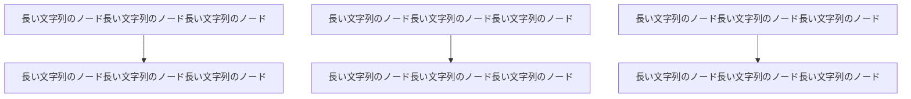

```mermaid
flowchart TD   
    A["長い文字列のノード長い文字列のノード長い文字列のノード"] --> B["長い文字列のノード長い文字列のノード長い文字列のノード"]
    style A white-space:nowrap;
    style B white-space:nowrap;
    C["長い文字列のノード長い文字列のノード長い文字列のノード"] --> D["長い文字列のノード長い文字列のノード長い文字列のノード"]
    classDef nowrap white-space:nowrap;
    class C,D nowrap;
    E["長い文字列のノード長い文字列のノード長い文字列のノード"]:::nowrap --> F["長い文字列のノード長い文字列のノード長い文字列のノード"]:::nowrap
    classDef nowrap white-space:nowrap;
```

```mermaid
---
config:
  markdownAutoWrap: false
---
```
