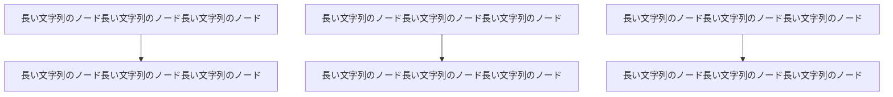
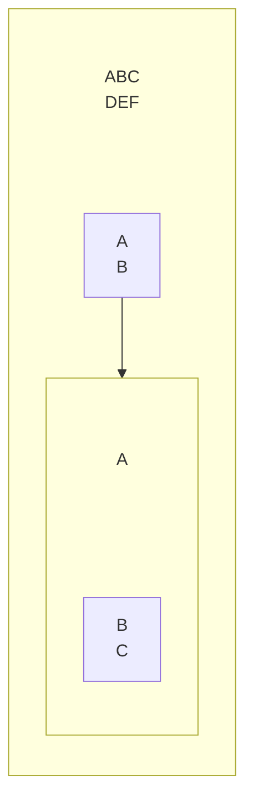

```mermaid
flowchart TD   
    A["長い文字列のノード長い文字列のノード長い文字列のノード"] --> B["長い文字列のノード長い文字列のノード長い文字列のノード"]
    style A white-space:nowrap;
    style B white-space:nowrap;
    C["長い文字列のノード長い文字列のノード長い文字列のノード"] --> D["長い文字列のノード長い文字列のノード長い文字列のノード"]
    classDef nowrap white-space:nowrap;
    class C,D nowrap;
    E["長い文字列のノード長い文字列のノード長い文字列のノード"]:::nowrap --> F["長い文字列のノード長い文字列のノード長い文字列のノード"]:::nowrap
    classDef nowrap white-space:nowrap;
```

```mermaid
---
config:
  markdownAutoWrap: false
---
```

```mermaid
---
config:
   markdownAutoWrap: false
   flowchart:
      curve: basic
---
flowchart TB

   subgraph SB1[" "]
      direction TB
      SB1_title["ABC
         DEF
      "]:::SB_title
      A["A
         B"]:::nowrap
      subgraph SB2[" "]
         direction TB
         SB2_title["A
         "]:::SB_title
         B["B
         C"]:::nowrap
      end
   end
   SB1_title ~~~ A
   A --> SB2
   SB2_title ~~~ B


   classDef SB_title white-space:nowrap,stroke-width:0px,fill:none;
   classDef nowrap white-space:nowrap;
```
